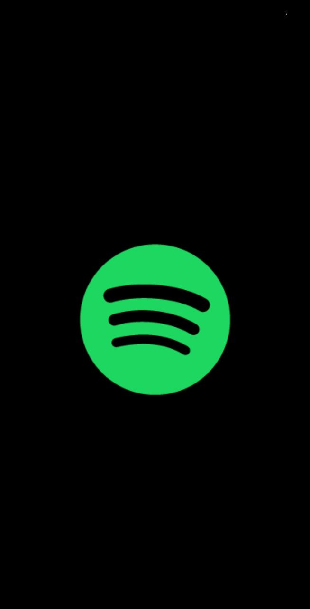
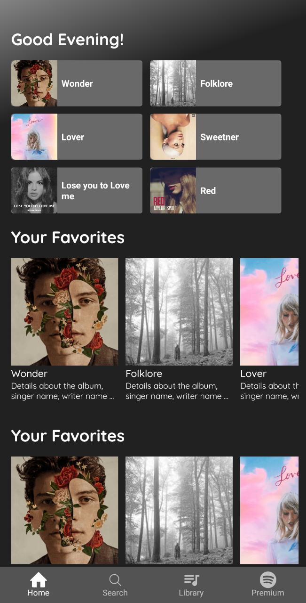
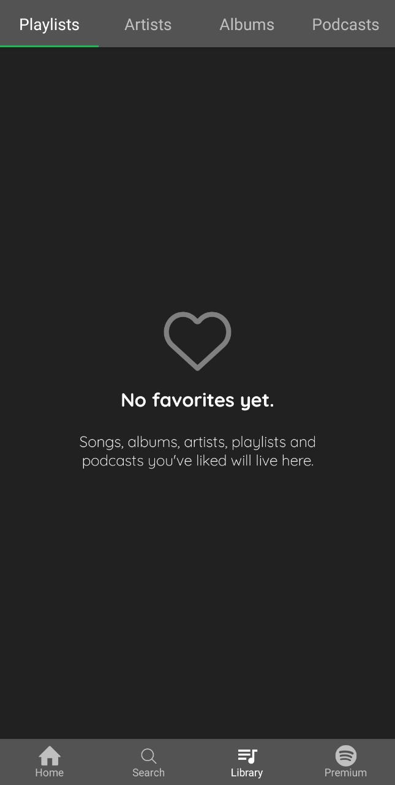
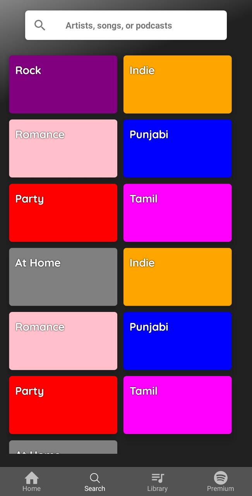
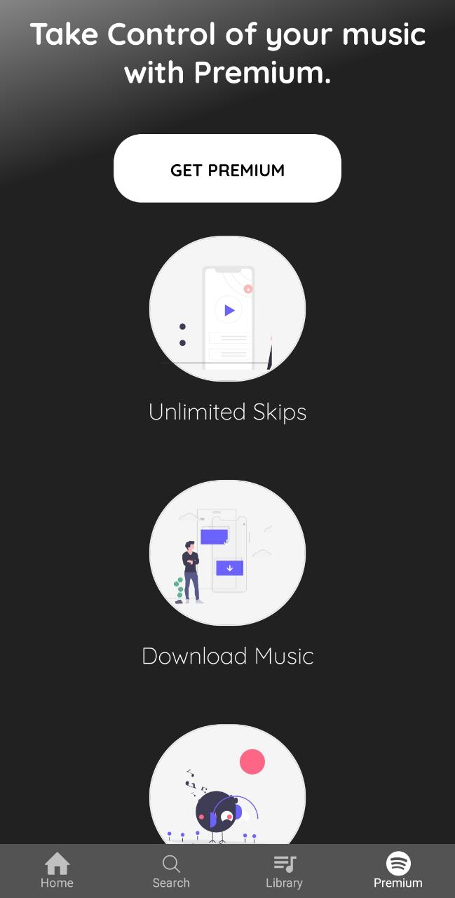

# Spotify Clone
The App is a clone of the Spotify App(just frontend).

# Tech Stack
- React Native

# Instruction to run the app
- Clone the repo
- Open the terminal and go to the repo
-      expo start

# Screens

### Splash Screen

  

### Home Screen

  

### Library Screen

  

### Search Screen

  

### Premium Screen

  

